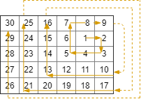

在 rows x cols 的网格上，你从单元格 (rStart, cStart) 面朝东面开始。网格的西北角位于第一行第一列，网格的东南角位于最后一行最后一列。

你需要以顺时针按螺旋状行走，访问此网格中的每个位置。每当移动到网格的边界之外时，需要继续在网格之外行走（但稍后可能会返回到网格边界）。

最终，我们到过网格的所有 rows x cols 个空间。

按照访问顺序返回表示网格位置的坐标列表。

示例 1：

输入：rows = 1, cols = 4, rStart = 0, cStart = 0
输出：[[0,0],[0,1],[0,2],[0,3]]
示例 2：

输入：rows = 5, cols = 6, rStart = 1, cStart = 4
输出：[[1,4],[1,5],[2,5],[2,4],[2,3],[1,3],[0,3],[0,4],[0,5],[3,5],[3,4],[3,3],[3,2],[2,2],[1,2],[0,2],[4,5],[4,4],[4,3],[4,2],[4,1],[3,1],[2,1],[1,1],[0,1],[4,0],[3,0],[2,0],[1,0],[0,0]]

提示：

1 <= rows, cols <= 100
0 <= rStart < rows
0 <= cStart < cols
