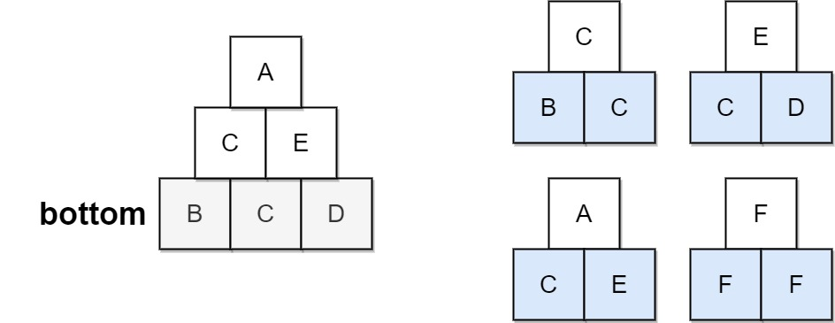
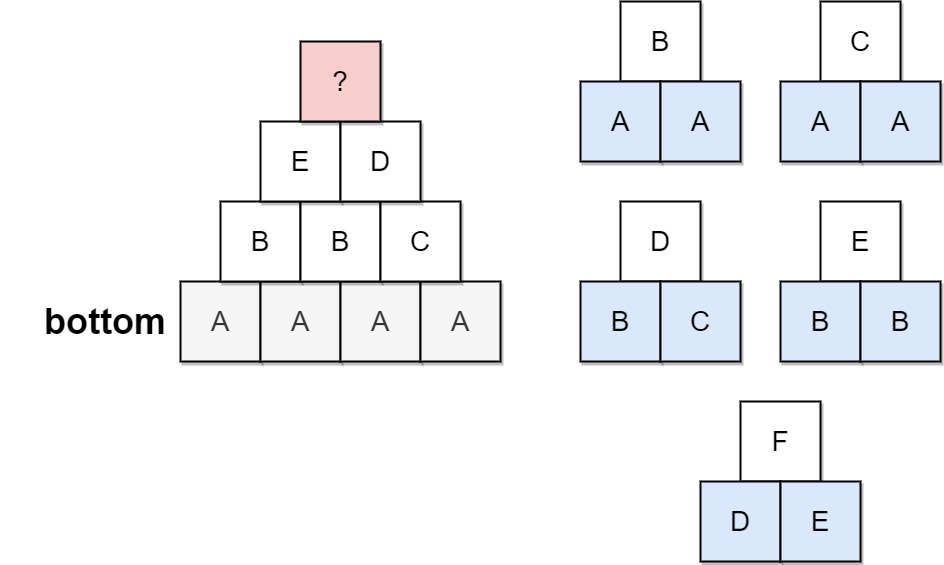

你正在把积木堆成金字塔。每个块都有一个颜色，用一个字母表示。每一行的块比它下面的行 少一个块 ，并且居中。

为了使金字塔美观，只有特定的 三角形图案 是允许的。一个三角形的图案由 两个块 和叠在上面的 单个块 组成。模式是以三个字母字符串的列表形式
allowed 给出的，其中模式的前两个字符分别表示左右底部块，第三个字符表示顶部块。

例如，"ABC" 表示一个三角形图案，其中一个 “C” 块堆叠在一个 'A' 块(左)和一个 'B' 块(右)之上。请注意，这与 "BAC" 不同，"B"
在左下角，"A" 在右下角。
你从作为单个字符串给出的底部的一排积木 bottom 开始，必须 将其作为金字塔的底部。

在给定 bottom 和 allowed 的情况下，如果你能一直构建到金字塔顶部，使金字塔中的 每个三角形图案 都是在 allowed 中的，则返回
true ，否则返回 false 。

示例 1：

输入：bottom = "BCD", allowed = ["BCC","CDE","CEA","FFF"]
输出：true
解释：允许的三角形图案显示在右边。
从最底层(第 3 层)开始，我们可以在第 2 层构建“CE”，然后在第 1 层构建“E”。
金字塔中有三种三角形图案，分别是 “BCC”、“CDE” 和 “CEA”。都是允许的。
示例 2：

输入：bottom = "AAAA", allowed = ["AAB","AAC","BCD","BBE","DEF"]
输出：false
解释：允许的三角形图案显示在右边。
从最底层(即第 4 层)开始，创造第 3 层有多种方法，但如果尝试所有可能性，你便会在创造第 1 层前陷入困境。

提示：

2 <= bottom.length <= 6
0 <= allowed.length <= 216
allowed[i].length == 3
所有输入字符串中的字母来自集合 {'A', 'B', 'C', 'D', 'E', 'F'}。
allowed 中所有值都是 唯一的
