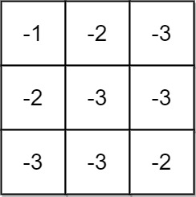
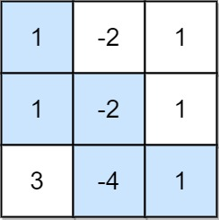
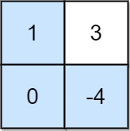

给你一个大小为 m x n 的矩阵 grid 。最初，你位于左上角 (0, 0) ，每一步，你可以在矩阵中 向右 或 向下 移动。

在从左上角 (0, 0) 开始到右下角 (m - 1, n - 1) 结束的所有路径中，找出具有 最大非负积 的路径。路径的积是沿路径访问的单元格中所有整数的乘积。

返回 最大非负积 对 10^9 + 7 取余 的结果。如果最大积为 负数 ，则返回 -1 。

注意，取余是在得到最大积之后执行的。

示例 1：

输入：grid = [[-1,-2,-3],[-2,-3,-3],[-3,-3,-2]]
输出：-1
解释：从 (0, 0) 到 (2, 2) 的路径中无法得到非负积，所以返回 -1 。

示例 2：

输入：grid = [[1,-2,1],[1,-2,1],[3,-4,1]]
输出：8
解释：最大非负积对应的路径如图所示 (1 * 1 * -2 * -4 * 1 = 8)

示例 3：

输入：grid = [[1,3],[0,-4]]
输出：0
解释：最大非负积对应的路径如图所示 (1 * 0 * -4 = 0)

提示：

m == grid.length
n == grid[i].length
1 <= m, n <= 15
-4 <= grid[i][j] <= 4
