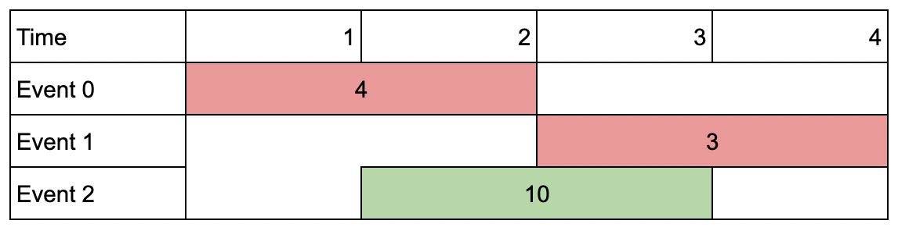

给你一个 events 数组，其中 events[i] = [startDay_i, endDay_i, value_i] ，表示第 i 个会议在 startDay_i 天开始，第 endDay_i
天结束，如果你参加这个会议，你能得到价值 value_i 。同时给你一个整数 k 表示你能参加的最多会议数目。

你同一时间只能参加一个会议。如果你选择参加某个会议，那么你必须 完整
地参加完这个会议。会议结束日期是包含在会议内的，也就是说你不能同时参加一个开始日期与另一个结束日期相同的两个会议。

请你返回能得到的会议价值 最大和 。

示例 1：

输入：events = [[1,2,4],[3,4,3],[2,3,1]], k = 2
输出：7
解释：选择绿色的活动会议 0 和 1，得到总价值和为 4 + 3 = 7 。

示例 2：

输入：events = [[1,2,4],[3,4,3],[2,3,10]], k = 2
输出：10
解释：参加会议 2 ，得到价值和为 10 。
你没法再参加别的会议了，因为跟会议 2 有重叠。你 不 需要参加满 k 个会议。

示例 3：

输入：events = [[1,1,1],[2,2,2],[3,3,3],[4,4,4]], k = 3
输出：9
解释：尽管会议互不重叠，你只能参加 3 个会议，所以选择价值最大的 3 个会议。

提示：

1 <= k <= events.length
1 <= k * events.length <= 10^6
1 <= startDay_i <= endDay_i <= 10^9
1 <= value_i <= 10^6
