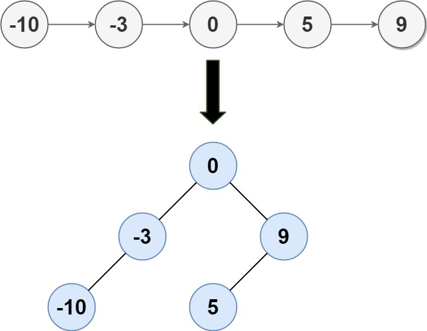

给定一个单链表的头节点 head ，其中的元素 按升序排序 ，将其转换为
平衡
二叉搜索树。

示例 1:

输入: head = [-10,-3,0,5,9]
输出: [0,-3,9,-10,null,5]
解释: 一个可能的答案是[0，-3,9，-10,null,5]，它表示所示的高度平衡的二叉搜索树。
示例 2:

输入: head = []
输出: []

提示:

head 中的节点数在[0, 2 * 10^4] 范围内
-10^5 <= Node.val <= 10^5
