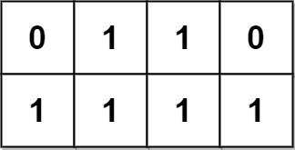
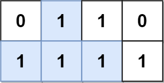
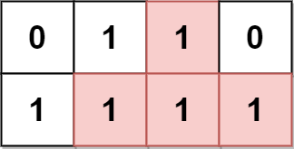
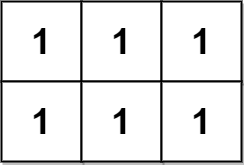
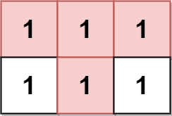
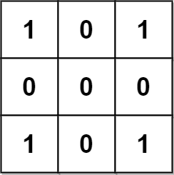
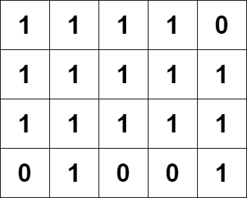
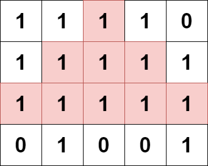

有一个 矩形网格 状的农场，划分为 m 行 n 列的单元格。每个格子要么是 肥沃的 （用 1 表示），要么是 贫瘠 的（用 0
表示）。网格图以外的所有与格子都视为贫瘠的。

农场中的 金字塔 区域定义如下：

区域内格子数目 大于 1 且所有格子都是 肥沃的 。
金字塔 顶端 是这个金字塔 最上方 的格子。金字塔的高度是它所覆盖的行数。令 (r, c) 为金字塔的顶端且高度为 h
，那么金字塔区域内包含的任一格子 (i, j) 需满足 r <= i <= r + h - 1 且 c - (i - r) <= j <= c + (i - r) 。
一个 倒金字塔 类似定义如下：

区域内格子数目 大于 1 且所有格子都是 肥沃的 。
倒金字塔的 顶端 是这个倒金字塔 最下方 的格子。倒金字塔的高度是它所覆盖的行数。令 (r, c) 为金字塔的顶端且高度为 h
，那么金字塔区域内包含的任一格子 (i, j) 需满足 r - h + 1 <= i <= r 且 c - (r - i) <= j <= c + (r - i) 。
下图展示了部分符合定义和不符合定义的金字塔区域。黑色区域表示肥沃的格子。

给你一个下标从 0 开始且大小为 m x n 的二进制矩阵 grid ，它表示农场，请你返回 grid 中金字塔和倒金字塔的 总数目 。

示例 1：

输入：grid = [[0,1,1,0],[1,1,1,1]]
输出：2
解释：
2 个可能的金字塔区域分别如上图蓝色和红色区域所示。
这个网格图中没有倒金字塔区域。
所以金字塔区域总数为 2 + 0 = 2 。

示例 2：

输入：grid = [[1,1,1],[1,1,1]]
输出：2
解释：
金字塔区域如上图蓝色区域所示，倒金字塔如上图红色区域所示。
所以金字塔区域总数目为 1 + 1 = 2 。

示例 3：

输入：grid = [[1,0,1],[0,0,0],[1,0,1]]
输出：0
解释：
网格图中没有任何金字塔或倒金字塔区域。

示例 4：

输入：grid = [[1,1,1,1,0],[1,1,1,1,1],[1,1,1,1,1],[0,1,0,0,1]]
输出：13
解释：
有 7 个金字塔区域。上图第二和第三张图中展示了它们中的 3 个。
有 6 个倒金字塔区域。上图中最后一张图展示了它们中的 2 个。
所以金字塔区域总数目为 7 + 6 = 13.

提示：

m == grid.length
n == grid[i].length
1 <= m, n <= 1000
1 <= m * n <= 10^5
grid[i][j] 要么是 0 ，要么是 1 。
