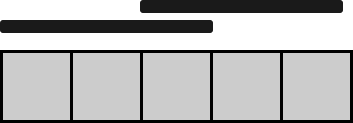

给你一个下标从 0 开始的 二进制 字符串 floor ，它表示地板上砖块的颜色。

floor[i] = '0' 表示地板上第 i 块砖块的颜色是 黑色 。
floor[i] = '1' 表示地板上第 i 块砖块的颜色是 白色 。
同时给你 numCarpets 和 carpetLen 。你有 numCarpets 条 黑色 的地毯，每一条 黑色 的地毯长度都为 carpetLen
块砖块。请你使用这些地毯去覆盖砖块，使得未被覆盖的剩余 白色 砖块的数目 最小 。地毯相互之间可以覆盖。

请你返回没被覆盖的白色砖块的 最少 数目。

示例 1：

输入：floor = "10110101", numCarpets = 2, carpetLen = 2
输出：2
解释：
上图展示了剩余 2 块白色砖块的方案。
没有其他方案可以使未被覆盖的白色砖块少于 2 块。
示例 2：

输入：floor = "11111", numCarpets = 2, carpetLen = 3
输出：0
解释：
上图展示了所有白色砖块都被覆盖的一种方案。
注意，地毯相互之间可以覆盖。

提示：

1 <= carpetLen <= floor.length <= 1000
floor[i] 要么是 '0' ，要么是 '1' 。
1 <= numCarpets <= 1000
