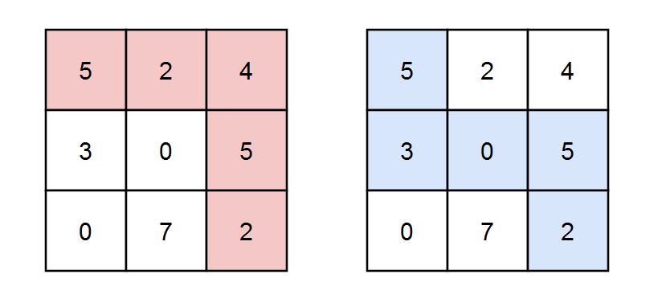

给你一个下标从 0 开始的 m x n 整数矩阵 grid 和一个整数 k 。你从起点 (0, 0) 出发，每一步只能往 下 或者往 右
，你想要到达终点 (m - 1, n - 1) 。

请你返回路径和能被 k 整除的路径数目，由于答案可能很大，返回答案对 109 + 7 取余 的结果。

示例 1：

输入：grid = [[5,2,4],[3,0,5],[0,7,2]], k = 3
输出：2
解释：有两条路径满足路径上元素的和能被 k 整除。
第一条路径为上图中用红色标注的路径，和为 5 + 2 + 4 + 5 + 2 = 18 ，能被 3 整除。
第二条路径为上图中用蓝色标注的路径，和为 5 + 3 + 0 + 5 + 2 = 15 ，能被 3 整除。

示例 2：

输入：grid = [[0,0]], k = 5
输出：1
解释：红色标注的路径和为 0 + 0 = 0 ，能被 5 整除。

示例 3：

输入：grid = [[7,3,4,9],[2,3,6,2],[2,3,7,0]], k = 1
输出：10
解释：每个数字都能被 1 整除，所以每一条路径的和都能被 k 整除。

提示：

m == grid.length
n == grid[i].length
1 <= m, n <= 5 * 10^4
1 <= m * n <= 5 * 10^4
0 <= grid[i][j] <= 100
1 <= k <= 50
