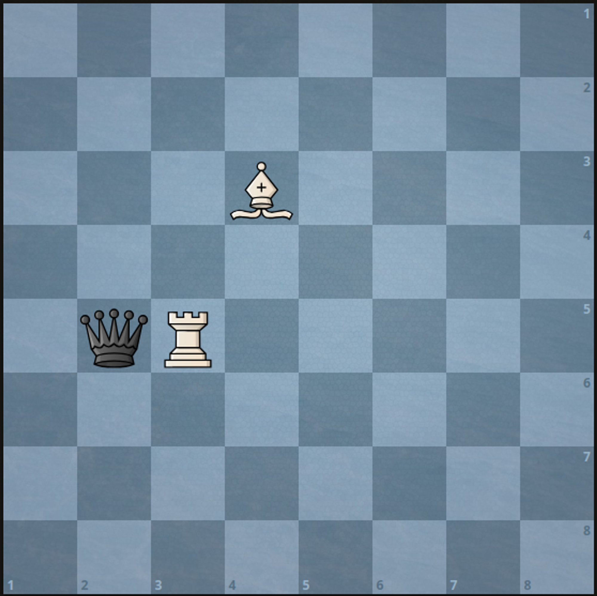

现有一个下标从 1 开始的 8 x 8 棋盘，上面有 3 枚棋子。

给你 6 个整数 a 、b 、c 、d 、e 和 f ，其中：

(a, b) 表示白色车的位置。
(c, d) 表示白色象的位置。
(e, f) 表示黑皇后的位置。
假定你只能移动白色棋子，返回捕获黑皇后所需的最少移动次数。

请注意：

车可以向垂直或水平方向移动任意数量的格子，但不能跳过其他棋子。
象可以沿对角线方向移动任意数量的格子，但不能跳过其他棋子。
如果车或象能移向皇后所在的格子，则认为它们可以捕获皇后。
皇后不能移动。

示例 1：

输入：a = 1, b = 1, c = 8, d = 8, e = 2, f = 3
输出：2
解释：将白色车先移动到 (1, 3) ，然后移动到 (2, 3) 来捕获黑皇后，共需移动 2 次。
由于起始时没有任何棋子正在攻击黑皇后，要想捕获黑皇后，移动次数不可能少于 2 次。

示例 2：

输入：a = 5, b = 3, c = 3, d = 4, e = 5, f = 2
输出：1
解释：可以通过以下任一方式移动 1 次捕获黑皇后：

- 将白色车移动到 (5, 2) 。
- 将白色象移动到 (5, 2) 。

提示：

1 <= a, b, c, d, e, f <= 8
两枚棋子不会同时出现在同一个格子上。
