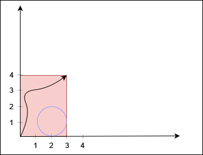
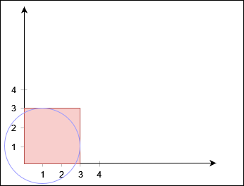
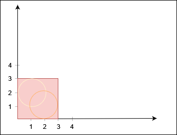
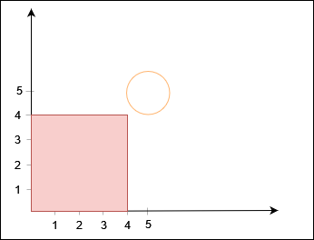

给你两个正整数 xCorner 和 yCorner 和一个二维整数数组 circles ，其中 circles[i] = [xi, yi, ri] 表示一个圆心在 (xi, yi) 半径为
ri 的圆。

坐标平面内有一个左下角在原点，右上角在 (xCorner, yCorner) 的矩形。你需要判断是否存在一条从左下角到右上角的路径满足：路径 完全
在矩形内部，不会 触碰或者经过 任何 圆的内部和边界，同时 只 在起点和终点接触到矩形。

如果存在这样的路径，请你返回 true ，否则返回 false 。

示例 1：

输入：X = 3, Y = 4, circles = [[2,1,1]]

输出：true

解释：

黑色曲线表示一条从 (0, 0) 到 (3, 4) 的路径。

示例 2：

输入：X = 3, Y = 3, circles = [[1,1,2]]

输出：false

解释：

不存在从 (0, 0) 到 (3, 3) 的路径。

示例 3：

输入：X = 3, Y = 3, circles = [[2,1,1],[1,2,1]]

输出：false

解释：

不存在从 (0, 0) 到 (3, 3) 的路径。

示例 4：

输入：X = 4, Y = 4, circles = [[5,5,1]]

输出：true

解释：

提示：

3 <= xCorner, yCorner <= 10^9
1 <= circles.length <= 1000
circles[i].length == 3
1 <= xi, yi, ri <= 10^9
