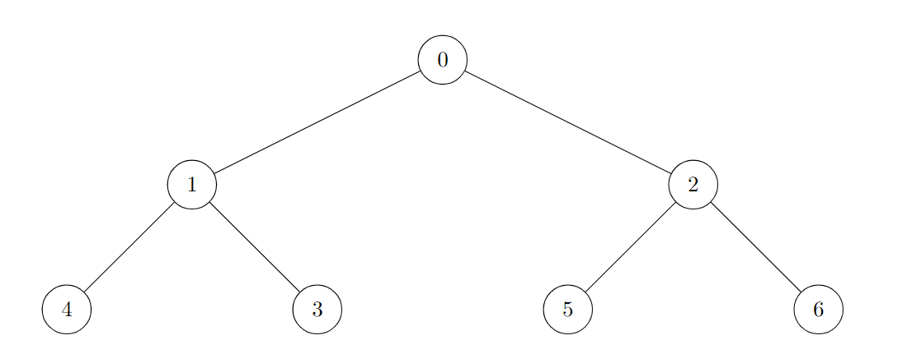
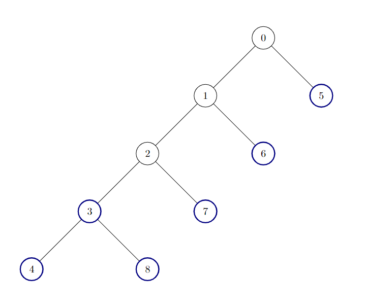
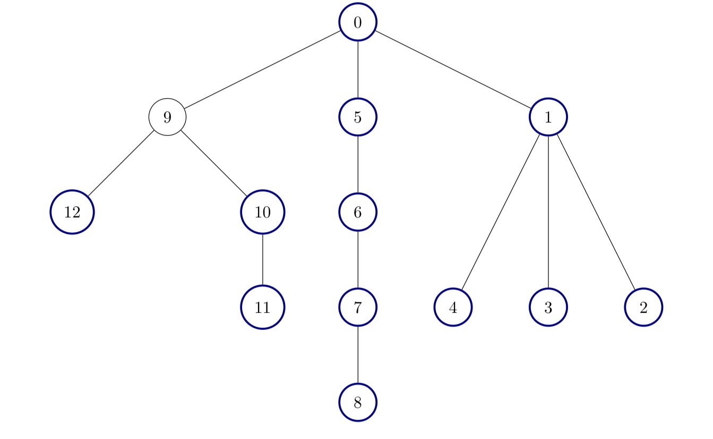

现有一棵 无向 树，树中包含 n 个节点，按从 0 到 n - 1 标记。树的根节点是节点 0 。给你一个长度为 n - 1 的二维整数数组 edges，其中
edges[i] = [a_i, b_i] 表示树中节点 a_i 与节点 b_i 之间存在一条边。

如果一个节点的所有子节点为根的
子树
包含的节点数相同，则认为该节点是一个 好节点。

返回给定树中 好节点 的数量。

子树 指的是一个节点以及它所有后代节点构成的一棵树。

示例 1：

输入：edges = [[0,1],[0,2],[1,3],[1,4],[2,5],[2,6]]

输出：7

说明：

树的所有节点都是好节点。

示例 2：

输入：edges = [[0,1],[1,2],[2,3],[3,4],[0,5],[1,6],[2,7],[3,8]]

输出：6

说明：

树中有 6 个好节点。上图中已将这些节点着色。

示例 3：

输入：edges = [[0,1],[1,2],[1,3],[1,4],[0,5],[5,6],[6,7],[7,8],[0,9],[9,10],[9,12],[10,11]]

输出：12

解释：

除了节点 9 以外其他所有节点都是好节点。

提示：

2 <= n <= 10^5
edges.length == n - 1
edges[i].length == 2
0 <= a_i, b_i < n
输入确保 edges 总表示一棵有效的树。
