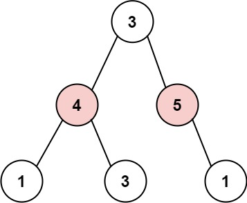

小偷又发现了一个新的可行窃的地区。这个地区只有一个入口，我们称之为 root 。

除了 root 之外，每栋房子有且只有一个“父“房子与之相连。一番侦察之后，聪明的小偷意识到“这个地方的所有房屋的排列类似于一棵二叉树”。
如果 两个直接相连的房子在同一天晚上被打劫 ，房屋将自动报警。

给定二叉树的 root 。返回 在不触动警报的情况下 ，小偷能够盗取的最高金额 。

示例 1:

输入: root = [3,2,3,null,3,null,1]
输出: 7
解释: 小偷一晚能够盗取的最高金额 3 + 3 + 1 = 7

示例 2:

输入: root = [3,4,5,1,3,null,1]
输出: 9
解释: 小偷一晚能够盗取的最高金额 4 + 5 = 9

提示：

树的节点数在 [1, 10^4] 范围内
0 <= Node.val <= 10^4
