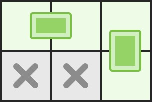
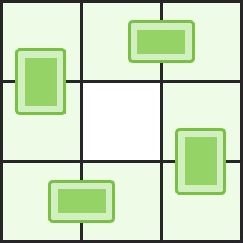

你有一块棋盘，棋盘上有一些格子已经坏掉了。你还有无穷块大小为1 *
2的多米诺骨牌，你想把这些骨牌不重叠地覆盖在完好的格子上，请找出你最多能在棋盘上放多少块骨牌？这些骨牌可以横着或者竖着放。

输入：n, m代表棋盘的大小；broken是一个b * 2的二维数组，其中每个元素代表棋盘上每一个坏掉的格子的位置。

输出：一个整数，代表最多能在棋盘上放的骨牌数。

示例 1：

输入：n = 2, m = 3, broken = [[1, 0], [1, 1]]
输出：2
解释：我们最多可以放两块骨牌：[[0, 0], [0, 1]]以及[[0, 2], [1, 2]]。（见下图）

示例 2：

输入：n = 3, m = 3, broken = []
输出：4
解释：下图是其中一种可行的摆放方式

限制：

1 <= n <= 8
1 <= m <= 8
0 <= b <= n * m
